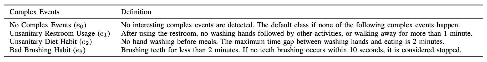

# CED_Methods_Eval

To download the datasets used in this project:

**Processed datasets for atomic activities (Optional):**
* The IMU dataset (ESC-50 + Kitchen20): https://drive.google.com/drive/folders/1K65vnkCIdqmULeFmgJvmjzneuZey6LAq?usp=drive_link.

* The audio dataset (WISDM): [https://drive.google.com/drive/folders/1WOlDvCEP5QiqrrmTEWn4F-eJHV0Drjtn?usp=sharing](https://drive.google.com/drive/folders/1WOlDvCEP5QiqrrmTEWn4F-eJHV0Drjtn?usp=drive_link).

**Synthetic complex event dataset:**
* The complex event dataset is synthesized using the atomic activity datasets above: https://drive.google.com/drive/folders/1tATqHHPHJO9_f0fI-n4gBZtRVd1QPbX4?usp=drive_link.
* Definition of the complex events:

* Description of the dataset:
  
  Consider a ($data$, $label$) sample pair from the dataset:
  * $data$ is a time series of embedding vectors, with dimension $60 \times 128$. It contains 60 timestamps of embedding vectors, and each 128-dim embedding vector encodes a 5-second window of fused IMU and audio sensor data. Hence, $data$ corresponds to a 5-minute sensor data.
  * $label$ is a time series of complex event labels, with dimension $60 \times 1$. It contains 60 timestamps of complex event labels, with 0 referring to $e_0$, 1 referring to $e_1$, 2 referring to $e_2$, and 3 referring to $e_3$. Example: if at timestamp $t$, the complex event label is $2$, then it means complex event $e_2$ is detected to "happen" in previous $0 - t$ timestamps. Note that by "happen" we refer to the exact time when the complete event pattern of complex event $e_2$ is observed.
